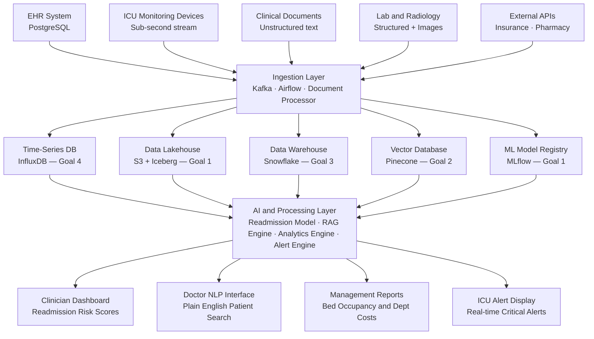

Data Management Systems — Assignment 01
Student ID: STU2511721


---
About This Assignment
This assignment was an eye-opening exploration of how different data technologies solve different kinds of problems. Going into this, I assumed SQL was the answer to everything — but working through each part made it clear why the industry has moved toward specialised storage systems. Each part taught me something genuinely new about how data is stored, queried, and processed at scale.
The dataset provided was a real-world style retail dataset — messy dates, inconsistent categories, NULL values — which made the cleaning and transformation work feel authentic rather than textbook.
---
Repository Structure
```
assignment-01-STU2511721/
│
├── datasets/
│   ├── orders_flat.csv           ← Denormalized flat file (Part 1)
│   ├── retail_transactions.csv   ← Multi-store raw transactions (Part 3)
│   ├── customers.csv             ← Customer master records (Part 5)
│   ├── orders.json               ← Order data in JSON format (Part 5)
│   └── products.parquet          ← Product catalog in Parquet format (Part 5)
│
├── part1-rdbms/
│   ├── normalization.md          ← Anomaly analysis + normalization argument
│   ├── schema_design.sql         ← 3NF schema design with sample data
│   └── queries.sql               ← 5 SQL queries (Q1–Q5)
│
├── part2-nosql/
│   ├── sample_documents.json     ← 3 MongoDB product documents
│   ├── mongodb_queries.js        ← MongoDB CRUD + indexing operations
│   └── rdbms_vs_nosql.md         ← Healthcare DB recommendation write-up
│
├── part3-datawarehouse/
│   ├── star_schema.sql           ← Star schema with fact + dimension tables
│   ├── dw_queries.sql            ← Analytical queries with MoM trend
│   └── etl_notes.md              ← ETL decisions and transformation reasoning
│
├── part4-vector-db/
│   ├── embeddings_demo.ipynb     ← Google Colab notebook (outputs saved)
│   └── vector_db_reflection.md   ← Vector DB reflection for legal search
│
├── part5-datalake/
│   ├── duckdb_queries.sql        ← Cross-format queries (CSV + JSON + Parquet)
│   └── architecture_choice.md    ← Lakehouse recommendation write-up
│
└── part6-capstone/
    ├── architecture_diagram.png  ← Full hospital AI architecture diagram
    └── design_justification.md   ← Design decisions, trade-offs, and boundaries
```
---
What I Learned in Each Part
Part 1 — Relational Databases
I started by analyzing `orders_flat.csv` — a single table with 186 rows and 15 columns where customer details, product details, and sales rep information were all crammed together. The first thing I noticed was that the same sales representative's office address was spelled two different ways across different rows — this is exactly the kind of update anomaly that causes real problems in production systems.
Normalizing this to 3NF meant creating four separate tables: `customers`, `products`, `sales_reps`, and `orders`. Every non-key attribute now depends only on the primary key of its table. Writing the SQL queries afterward felt much cleaner once the schema was properly structured.
What surprised me: The manager argument against normalization actually made me think. For a small 186-row dataset, one table is genuinely simpler. But the moment data grows — or multiple people write to it simultaneously — the anomalies become real business problems that cost time and money to fix.
---
Part 2 — NoSQL / MongoDB
This part challenged my assumption that relational is always better. Designing MongoDB documents for Electronics, Clothing, and Groceries made the advantage obvious — a TV needs warranty and voltage fields, a shirt needs size charts and color variants, and a grocery item needs expiry dates and nutritional info. In a relational schema, you'd either have hundreds of nullable columns or a complex EAV pattern. In MongoDB, each document just has exactly the fields it needs.
The ACID vs BASE discussion for the healthcare scenario was the most intellectually interesting part of this assignment. The conclusion I reached — MySQL for core patient records, a NoSQL or graph database for fraud detection — felt like a genuine engineering decision rather than a textbook answer.
---
Part 3 — Data Warehouse
Working with `retail_transactions.csv` was humbling. The data had three different date formats in the same column, categories spelled in inconsistent cases, and several rows with NULL city values. This is what ETL work actually looks like in practice.
Building the star schema forced me to think carefully about grain — every row in `fact_sales` represents exactly one transaction. The dimension tables (dim_date, dim_store, dim_product) exist to avoid repeating descriptive data in the fact table. The month-over-month trend query using a CTE was the most complex SQL I have written so far.
Key insight: Pre-computing calendar attributes in `dim_date` (month name, quarter, is_weekend) means analytical queries never need string parsing or date functions at runtime — they just GROUP BY an integer key. This is a big part of why data warehouses are fast for reporting.
---
Part 4 — Vector Databases
This was the most unfamiliar and fascinating part of the assignment. I had heard of embeddings before but never actually generated them. Running the `all-MiniLM-L6-v2` model in Google Colab and seeing the 10×10 cosine similarity heatmap produce bright yellow clusters along the diagonal — Cricket sentences grouped together, Cooking sentences grouped together, Cybersecurity sentences grouped together — made the concept click in a way that reading about it never did.
The query result was the most satisfying moment: asking "The bowler took three wickets in one over" and getting back Cricket sentences as the top matches even though the exact words don't appear in those sentences. That is semantic search working in practice.
For the law firm use case, I realised that keyword search would completely miss clauses that use different vocabulary for the same legal concept. Terms like "termination," "dissolution," and "break clause" all mean the same thing in different contracts. A vector database solves this by searching on meaning rather than exact words.
---
Part 5 — Data Lake & DuckDB
DuckDB genuinely surprised me. The ability to write SQL directly against a CSV file, a JSON file, and a Parquet file in the same query — without creating any tables or loading any data into a database — feels incredibly powerful for data exploration work. The `read_csv_auto()`, `read_json_auto()`, and `read_parquet()` functions handle schema inference automatically, which saves a huge amount of setup time.
For the food delivery startup architecture recommendation, I argued for a Data Lakehouse over a pure warehouse or pure data lake. The multi-modal data (GPS location logs, text reviews, payment records, restaurant menu images) simply cannot be forced into a warehouse schema without losing raw data fidelity — and a raw data lake without table format guarantees like Apache Iceberg would be too slow and unstructured for reliable BI reporting.
---
Part 6 — Capstone
Designing the hospital architecture from scratch was the most realistic and challenging exercise in the assignment. The four goals pulled in completely different directions — ICU vitals need sub-second real-time storage (Time-Series DB), readmission prediction needs historical batch training data (Data Lakehouse), management reports need pre-aggregated OLAP queries (Data Warehouse), and doctor NLP queries need semantic similarity search (Vector DB). No single storage system handles all four requirements well, which is exactly why modern data architectures are multi-system by design.
The trade-off I identified — operational complexity of running six distinct systems simultaneously — is a genuine concern in the industry. The mitigation strategy I proposed (managed cloud services plus phased implementation) reflects how real engineering teams actually approach this problem rather than trying to build everything at once.
---
Grading Breakdown
Part	Topic	Marks
Part 1	RDBMS	25
Part 2	NoSQL	15
Part 3	Data Warehouse	20
Part 4	Vector Databases	15
Part 5	Data Lake & DuckDB	10
Part 6	Capstone Design	15
Total		100
---
Capstone Architecture Overview

---
Technologies Used
Technology	Purpose in This Assignment
MySQL / PostgreSQL	Schema design, normalization, SQL queries (Part 1, 3)
MongoDB	Document storage for heterogeneous product catalogs (Part 2)
sentence-transformers	Generating sentence embeddings for similarity search (Part 4)
DuckDB	Querying raw CSV, JSON, Parquet files directly with SQL (Part 5)
Apache Kafka + Iceberg	Real-time ingestion and lakehouse storage (Part 6 capstone)
Pinecone / Weaviate	Vector similarity search over clinical documents (Part 6 capstone)
Google Colab	Running the embedding notebook with GPU support (Part 4)
---
Notes
All SQL files are written for MySQL syntax. Minor adjustments may be needed for PostgreSQL (`AUTO_INCREMENT` → `SERIAL`, etc).
The Jupyter notebook in Part 4 was run on Google Colab with all cell outputs saved and visible inside the notebook file.
DuckDB queries in Part 5 assume the raw data files are in the same working directory as the SQL file. Update file paths if running from a different location.